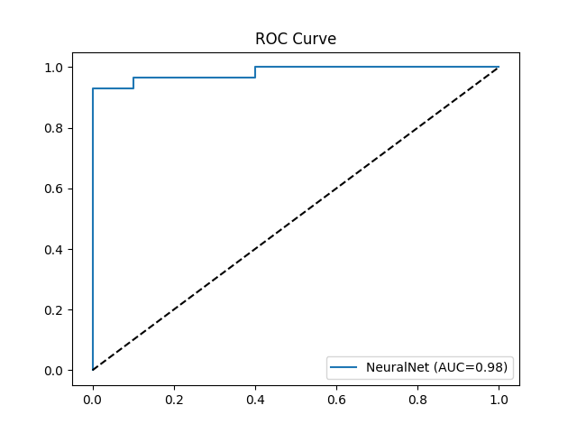
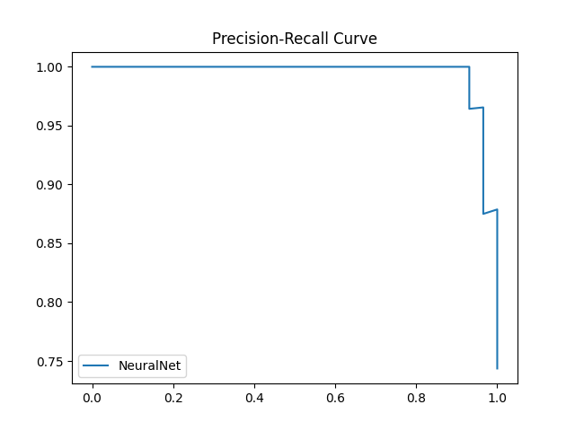

# 🧩 Parkinson’s Prediction – ML & AI Final Project  

## 📖 Overview  
This project implements a **Machine Learning pipeline** for predicting **Parkinson’s disease** based on biomedical voice features.  
The system compares multiple models, evaluates their performance, and deploys an **interactive Streamlit application** that allows:  
- 📊 Comparing models with customizable hyperparameters  
- 🔮 Making predictions for single patients or CSV batches  
- ⚡ Training new models with uploaded datasets  
- 🏆 Promoting the best-performing model for production use  

---

## 📂 Project Structure  
```
├── app/
│   ├── streamlit_app.py     # Main Streamlit application
├── data/
│   └── parkinsons.data      # Dataset (UCI repository)
├── models/
│   └── best_model.joblib    # Saved best model
├── assets/
│   ├── metrics.json         # Saved performance metrics
│   ├── roc_curve.png        # ROC curve visualization
│   ├── pr_curve.png         # Precision-Recall curve
│   ├── learning_curve.png   # Learning curve
│   └── screenshot_dashboard.png   # Example app screenshot
├── src/
│   └── utils.py             # Utility functions (paths, constants, helpers)
├── requirements.txt         # Dependencies
└── README.md                # Project documentation
```

---

## 📊 Dataset  
- **Source:** [UCI Parkinson’s Dataset](https://archive.ics.uci.edu/ml/datasets/parkinsons)  
- **Size:** 195 samples from 31 patients (23 with Parkinson’s, 8 healthy)  
- **Features:** Voice-based biomedical measurements such as jitter, shimmer, NHR, HNR, PPE, etc.  
- **Target:** `status` (1 = Parkinson’s, 0 = healthy)  

---

## 🤖 Models Implemented  
We trained and compared multiple models from different algorithm families:  
- Logistic Regression (baseline, interpretable)  
- Random Forest (bagging, ensemble of trees)  
- XGBoost (boosting, high performance)  
- LightGBM (efficient boosting)  
- CatBoost (robust boosting)  
- SVM (support vector machine, kernel-based)  
- KNN (nearest neighbors)  
- NeuralNet (MLPClassifier, deep learning)  

---

## ⚙️ Features of the App  
- **Dashboard:** Compare models, view metrics, ROC and PR curves  
- **Predict:** Predict Parkinson’s for a single patient or upload CSV for batch prediction  
- **Train New Model:** Upload new data, retrain models, compare to old best, promote new best model  
- **Artifacts Saved:** Best model, metrics, and plots stored in `/models` and `/assets`  

---

## 📦 Installation  

Clone the repository and install dependencies:  
```bash
git clone https://github.com/YourUsername/parkinsons-prediction.git
cd parkinsons-prediction
pip install -r requirements.txt
```

---

## 🚀 Run the App  
Start the Streamlit app:  
```bash
streamlit run app/streamlit_app.py
```

---

## 📈 Example Results  
Typical ROC-AUC scores:  
- XGBoost: ~0.94 🏆  
- LightGBM: ~0.93  
- CatBoost: ~0.92  
- Random Forest: ~0.91  
- Logistic Regression: ~0.87  
- NeuralNet: ~0.90  

---

## 🖼️ Example Screenshots  

### Dashboard  
  

### ROC Curve  
  

### Precision-Recall Curve  
  

---

## 🧑‍⚕️ Importance in Healthcare  
- In medical prediction tasks, **Recall** (sensitivity) is critical to avoid missing sick patients.  
- Boosting models provided the best trade-off between Recall and Precision, making them the preferred choice for this dataset.  

---

## 📌 Future Improvements  
- Add cross-validation instead of single train/test split  
- Apply feature selection to reduce dimensionality  
- Improve interpretability with SHAP values  
- Deploy as a cloud service (e.g., FastAPI + Docker + Streamlit Cloud)  

---

✍️ **Authors:** Afeka ML & AI Final Project Team  
📅 **Year:** 2025  
